# Debug Analysis: Session 019ee709

## End-to-End Communication Sequence Diagram

```mermaid
sequenceDiagram
    participant FE as Frontend<br/>(Svelte 5 SPA)
    participant WS as WebSocket<br/>Repository
    participant BE as Backend<br/>(FastAPI)
    participant AP as AgentProcess<br/>(State Machine)
    participant PI as Pi Agent<br/>(--mode rpc)
    participant SF as Session File<br/>(.jsonl)
    participant API as Model API<br/>(opencode-go)

    Note over FE,API: ═══════════════════════════════════════════════════════════════
    Note over FE,API: PHASE 1: WebSocket Connection
    Note over FE,API: ═══════════════════════════════════════════════════════════════

    FE->>WS: connect("019ee709-6672-730a-9865-01ffc0592902")
    WS->>BE: WebSocket /ws/sessions/{id}

    BE->>AP: registry.get(session_id)
    alt Session not found
        AP-->>BE: None
        BE->>WS: Close(4004)
        WS->>FE: disconnected
    else Session found
        AP-->>BE: LiveSession{agent: AgentProcess}
        BE->>WS: Accept WebSocket
    end

    Note over FE,API: ═══════════════════════════════════════════════════════════════
    Note over FE,API: PHASE 2: Initial Snapshot (State + Messages)
    Note over FE,API: ═══════════════════════════════════════════════════════════════

    BE->>AP: send(GetStateCommand)
    AP->>AP: Generate id="req-1"
    AP->>AP: Create Future, store in _pending["req-1"]
    AP->>PI: {"type":"get_state","id":"req-1"}\n (via stdin)

    PI->>SF: Read session state
    PI-->>AP: {"type":"response","id":"req-1",<br/>"command":"get_state","success":true,<br/>"data":{"sessionId":"019ee709",...}} (via stdout)

    AP->>AP: _read_stdout() parses JSONL line
    AP->>AP: isinstance(event, ResponseEvent) = true
    AP->>AP: event.id = "req-1" matches _pending key
    AP->>AP: future.set_result(event) → resolves Future
    AP-->>BE: ResponseEvent

    BE->>AP: send(GetMessagesCommand)
    AP->>PI: {"type":"get_messages","id":"req-2"}\n
    PI->>SF: Read messages
    PI-->>AP: {"type":"response","id":"req-2",...}
    AP-->>BE: ResponseEvent

    BE->>WS: {"kind":"snapshot","state":{...},"messages":[...]}
    WS->>FE: onSnapshot handler
    FE->>FE: sessionState = state<br/>messages = msgs<br/>status = 'success'

    Note over FE,API: ═══════════════════════════════════════════════════════════════
    Note over FE,API: PHASE 3: Event Forwarding Setup
    Note over FE,API: ═══════════════════════════════════════════════════════════════

    BE->>AP: subscribe(replay=False)
    AP->>AP: Create asyncio.Queue, add to _subscribers set

    BE->>BE: asyncio.create_task(_forward_events(websocket, session))
    Note right of BE: Background task:<br/>async for event in session.agent.subscribe():<br/>  await websocket.send_text(json.dumps({kind:"event", event:event.raw}))

    Note over FE,API: ═══════════════════════════════════════════════════════════════
    Note over FE,API: PHASE 4: User Sends Prompt
    Note over FE,API: ═══════════════════════════════════════════════════════════════

    FE->>FE: handleSend() called
    FE->>FE: sessionStore.sendPrompt("what is this repo about?")
    FE->>WS: ws.send({type:"prompt", message:"what is this repo about?"})
    WS->>BE: websocket.receive_text()

    BE->>BE: _handle_client_message(websocket, session, data)
    BE->>BE: msg = json.loads(data)<br/>msg_type = "prompt"

    BE->>BE: asyncio.create_task(run_command())
    Note right of BE: Background task (non-blocking)<br/>Allows event forwarding to continue

    BE->>AP: send(PromptCommand(message="what is this repo about?"))
    AP->>AP: Generate id="req-3"
    AP->>AP: Create Future, store in _pending["req-3"]
    AP->>PI: {"type":"prompt","message":"what is this repo about?",<br/>"id":"req-3"}\n (via stdin)

    Note over FE,API: ═══════════════════════════════════════════════════════════════
    Note over FE,API: PHASE 5: Pi Processes Prompt
    Note over FE,API: ═══════════════════════════════════════════════════════════════

    PI->>SF: Save user message to session file ✅

    Note over PI,API: ⚠️ CRITICAL FAILURE POINT<br/>Pi should now:<br/>1. Call model API<br/>2. Generate response event<br/>3. Stream message_update events<br/>BUT NONE OF THIS HAPPENS

    rect rgb(255, 230, 230)
        Note over PI,API: EXPECTED BUT NOT HAPPENING
        PI->>API: POST /v1/chat/completions<br/>{"model":"mimo-v2.5-pro",<br/>"messages":[...]}
        API-->>PI: {"choices":[{"message":{"content":"..."}}]}
        PI-->>AP: {"type":"response","id":"req-3",<br/>"command":"prompt","success":true}
        AP->>AP: Correlates by id="req-3"<br/>Resolves Future in _pending
    end

    Note over FE,API: ═══════════════════════════════════════════════════════════════
    Note over FE,API: EXPECTED: Streaming Events (Not Happening)
    Note over FE,API: ═══════════════════════════════════════════════════════════════

    rect rgb(255, 230, 230)
        PI-->>AP: {"type":"agent_start"}
        AP->>AP: Not ResponseEvent → _ring_buffer.append()<br/>→ _broadcast(event) to all subscriber queues
        AP->>BE: Event via subscriber queue
        BE->>WS: {"kind":"event","event":{"type":"agent_start",...}}
        WS->>FE: onEvent handler
        FE->>FE: handleEvent(event)<br/>→ status = 'streaming'

        PI-->>AP: {"type":"turn_start"}
        PI-->>AP: {"type":"message_start","message":{role:"assistant",...}}

        loop For each text chunk
            PI-->>AP: {"type":"message_update",<br/>"assistantMessageEvent":{"type":"text_delta","delta":"chunk"}}
            AP->>BE: Event via subscriber queue
            BE->>WS: {"kind":"event","event":{...}}
            WS->>FE: onEvent handler
            FE->>FE: handleEvent(event) → handleMessageUpdate(event)
            Note right of FE: assistantMessageEvent.type = "text_delta"<br/>→ Append delta to last assistant message<br/>→ messages[lastIdx].content += delta
        end

        PI-->>AP: {"type":"message_end","message":{...}}
        PI-->>AP: {"type":"turn_end","message":{...},"toolResults":[]}
        PI-->>AP: {"type":"agent_end","messages":[...]}
        FE->>FE: handleEvent(event) → status = 'success'
    end

    Note over FE,API: ═══════════════════════════════════════════════════════════════
    Note over FE,API: PHASE 6: Timeout (After 30 seconds)
    Note over FE,API: ═══════════════════════════════════════════════════════════════

    AP->>AP: asyncio.wait_for(future, timeout=30.0)
    AP->>AP: TimeoutError!
    AP->>AP: _pending.pop("req-3", None)

    Note over BE: run_command() catches exception
    BE->>BE: logger.error("Failed to handle client message: ...")
    BE->>WS: {"kind":"error","reason":"Command failed: ..."}
    WS->>FE: onError handler
    FE->>FE: status = {status:'error', error:...}

    Note over FE,API: ═══════════════════════════════════════════════════════════════
    Note over FE,API: PHASE 7: Stderr Issue (Silent Failure)
    Note over FE,API: ═══════════════════════════════════════════════════════════════

    Note over PI: stderr is captured but NEVER READ<br/>If pi writes errors to stderr:<br/>1. Pipe buffer fills (64KB)<br/>2. Pi blocks on stderr write<br/>3. Pi stops generating stdout events<br/>4. System hangs silently
```



## Root Cause Analysis

### The Problem

Session 019ee709 shows:
- ✅ User message appears in frontend
- ✅ User message saved to session file (`~/.pi/agent/sessions/`)
- ❌ No assistant response events
- ❌ No `agent_start`, `turn_start`, `message_update` events
- ❌ Session file has no assistant messages

### Critical Failure Point: Phase 5

After pi receives the prompt command:
1. Pi saves the user message to the session file ✅
2. Pi should call model API ❌ **NOT HAPPENING**
3. Pi should generate `response` event (acknowledgment) ❌ **NOT HAPPENING**
4. Pi should generate streaming events ❌ **NOT HAPPENING**

### Root Causes (Ordered by Likelihood)

#### 1. **Model API Failure** (Most Likely)

Pi is configured to use:
- Provider: `opencode-go`
- Model: `mimo-v2.5-pro`

Pi settings file (`~/.pi/agent/settings.json`):
```json
{
  "defaultProvider": "opencode-go",
  "defaultModel": "mimo-v2.5-pro"
}
```

**Possible failures:**
- Authentication failure (missing/invalid API key in `~/.pi/agent/auth.json`)
- Network timeout reaching opencode-go API
- Rate limiting
- Model not available
- API endpoint changed

#### 2. **Stderr Pipe Full** (Critical Code Bug)

**Bug in `agent_process.py`:** stderr is captured but never read.

```python
# Line 130 in agent_process.py
process = await asyncio.create_subprocess_exec(
    *cmd,
    stdin=asyncio.subprocess.PIPE,
    stdout=asyncio.subprocess.PIPE,
    stderr=asyncio.subprocess.PIPE,  # ← Captured but NEVER READ!
    cwd=cwd,
)
```

If pi writes errors to stderr (e.g., API errors, warnings):
1. Pipe buffer fills up (typically 64KB)
2. Pi blocks on stderr write
3. Pi stops generating stdout events
4. System hangs silently

**Evidence:** No error logs appear because pi's stderr is never forwarded to Python logging.

#### 3. **Process Crash**

Pi might crash after receiving the prompt:
- Out of memory
- Unhandled exception
- Segfault

**Evidence:** If process crashed, `is_alive` would return False and `send()` would raise `AgentProcessError("Subprocess is not running")` instead of timing out.

#### 4. **Working Directory Issue**

Pi is spawned with `cwd=/srv/workspace/byte-brewery`. If this directory doesn't exist or has permission issues, pi might fail silently.

### Why Frontend Shows Empty Assistant Bubble

The frontend `handleMessageUpdate()` only processes `text_delta` events:

```typescript
// session.svelte.ts line 162
if (assistantMessageEvent.type === 'text_delta') {
    // Append delta to existing message
}
```

If no `text_delta` events are received, no assistant message is created. The user message appears because it's added to the messages array from the snapshot or from the initial `get_messages` response.

## Diagnostic Commands

### 1. Check if Pi Process is Alive

```bash
# SSH into VPS
ssh ubuntu@51.83.199.194

# Find pi process for this session
ps aux | grep "019ee709"

# Check process tree
pstree -p $(pgrep -f "019ee709")

# Check if process is consuming CPU
top -p $(pgrep -f "019ee709")

# Check process status
cat /proc/$(pgrep -f "019ee709")/status 2>/dev/null | head -10
```

### 2. Check Backend Logs

```bash
# Recent logs
journalctl --user -u remote-agents -n 200

# Filter for errors
journalctl --user -u remote-agents -n 500 | grep -E "(error|Error|ERROR|Failed|failed|Exception|Traceback)"

# Filter for this session
journalctl --user -u remote-agents -n 500 | grep "019ee709"

# Filter for timeout
journalctl --user -u remote-agents -n 500 | grep -i "timeout"

# Filter for command responses
journalctl --user -u remote-agents -n 500 | grep "req-"

# Filter for event parsing issues
journalctl --user -u remote-agents -n 500 | grep "Failed to parse event"
```

### 3. Check Session File

```bash
# Full session file
cat ~/.pi/agent/sessions/--srv-workspace-byte-brewery--/*019ee709*.jsonl

# Count lines
wc -l ~/.pi/agent/sessions/--srv-workspace-byte-brewery--/*019ee709*.jsonl

# Check for assistant messages
grep "assistant" ~/.pi/agent/sessions/--srv-workspace-byte-brewery--/*019ee709*.jsonl

# Check for error events
grep "error" ~/.pi/agent/sessions/--srv-workspace-byte-brewery--/*019ee709*.jsonl

# Check for response events
grep "response" ~/.pi/agent/sessions/--srv-workspace-byte-brewery--/*019ee709*.jsonl
```

### 4. Check Pi Configuration

```bash
# Check pi settings
cat ~/.pi/agent/settings.json

# Check pi auth (DO NOT SHOW KEYS, just check structure)
python3 -c "import json; d=json.load(open('/home/ubuntu/.pi/agent/auth.json')); print(list(d.keys()))"

# Check pi version
pi --version

# Check available models
pi --list-models 2>&1 | head -20
```

### 5. Test Pi Directly

```bash
# Navigate to the repo
cd /srv/workspace/byte-brewery

# Test get_state (should work)
echo '{"type":"get_state"}' | timeout 10 pi --mode rpc --no-session

# Test prompt (should generate events)
echo '{"type":"prompt","message":"hello"}' | timeout 30 pi --mode rpc --no-session

# Test with explicit provider/model
echo '{"type":"prompt","message":"hello"}' | timeout 30 pi --mode rpc --no-session --provider opencode-go --model mimo-v2.5-pro
```

### 6. Check System Resources

```bash
# Memory usage
free -h

# Disk space
df -h

# Check for OOM kills
dmesg | grep -i "oom\|killed"

# Check systemd journal for OOM
journalctl --user -u remote-agents -n 1000 | grep -i "oom\|killed\|memory"
```

### 7. Test WebSocket Directly

```bash
# Install wscat if not present
npm install -g wscat

# Connect to WebSocket
wscat -c ws://localhost:8080/ws/sessions/019ee709-6672-730a-9865-01ffc0592902

# Send a prompt
{"type":"prompt","message":"hello"}

# Watch for events (should see agent_start, message_update, etc.)
```

### 8. Check Pi Stderr (If Possible)

```bash
# If you can find the pi process PID
PID=$(pgrep -f "019ee709")
if [ -n "$PID" ]; then
    # Read stderr
    cat /proc/$PID/fd/2
fi
```

## Code Issues Found

### Issue 1: Stderr Never Read (Critical)

**File:** `backend/app/rpc/agent_process.py`
**Line:** 130

**Problem:** stderr is captured but never read. If pi writes errors to stderr, the pipe buffer fills up and pi blocks.

**Current Code:**
```python
process = await asyncio.create_subprocess_exec(
    *cmd,
    stdin=asyncio.subprocess.PIPE,
    stdout=asyncio.subprocess.PIPE,
    stderr=asyncio.subprocess.PIPE,  # Captured but never read!
    cwd=cwd,
)
```

**Fix:**
```python
# In AgentProcess.__init__
self._stderr_task: asyncio.Task[None] | None = None

# In start_detached
proc._stderr_task = asyncio.create_task(proc._read_stderr())

# New method
async def _read_stderr(self) -> None:
    """Background task: read stderr and log it."""
    assert self._process.stderr is not None
    try:
        async for line in read_jsonl_lines(self._process.stderr):
            logger.warning("pi stderr: %s", line)
    except Exception as e:
        logger.error("stderr reader error: %s", e)
```

### Issue 2: Missing Event Types

**File:** `backend/app/rpc/types.py`
**Line:** 217

**Problem:** Missing event types from pi RPC protocol:
- `tool_execution_update`
- `compaction_start`
- `compaction_end`
- `auto_retry_start`
- `auto_retry_end`
- `extension_error`

**Impact:** These events fall back to generic `Event` class, which works but loses type safety.

### Issue 3: No Health Check for Stuck Prompts

**File:** `backend/app/api/ws.py`

**Problem:** No mechanism to detect if pi is stuck. The 30-second timeout in `send()` is the only safeguard.

**Fix:** Add a health check endpoint and periodic ping to detect stuck processes.

## Recommended Fixes

### 1. Add Stderr Reading (Critical - Fix Immediately)

```python
# In AgentProcess class

async def _read_stderr(self) -> None:
    """Background task: read stderr and log it."""
    assert self._process.stderr is not None
    try:
        async for line in read_jsonl_lines(self._process.stderr):
            logger.warning("pi stderr: %s", line)
    except asyncio.CancelledError:
        pass
    except Exception as e:
        logger.error("stderr reader error: %s", e)

# In start_detached method
proc._stderr_task = asyncio.create_task(proc._read_stderr())
```

### 2. Add Missing Event Types

```python
# In types.py, add to _EVENT_TYPES
_EVENT_TYPES: dict[str, type[Event]] = {
    # ... existing types ...
    "tool_execution_update": ToolExecutionUpdateEvent,
    "compaction_start": CompactionStartEvent,
    "compaction_end": CompactionEndEvent,
    "auto_retry_start": AutoRetryStartEvent,
    "auto_retry_end": AutoRetryEndEvent,
    "extension_error": ExtensionErrorEvent,
}
```

### 3. Add Health Check Endpoint

```python
# In sessions.py
@router.get("/sessions/{session_id}/health")
async def session_health(session_id: str):
    registry = get_registry()
    session = registry.get(session_id)
    if not session:
        return {"status": "not_found"}
    return {
        "status": "alive" if session.is_alive else "dead",
        "pid": session.agent._process.pid,
        "returncode": session.agent._process.returncode,
    }
```

### 4. Add Event Logging for Debugging

```python
# In _read_stdout
async for line in read_jsonl_lines(self._process.stdout):
    logger.debug("pi stdout: %s", line)  # Add this line
    try:
        raw = json.loads(line)
        event = parse_event(raw)
    except Exception as e:
        logger.warning("Failed to parse event: %s (line=%s)", e, line)
        continue
```

## Summary

**Root Cause:** Pi agent process receives the prompt but does not generate any response events. Most likely due to:
1. Model API failure (authentication, network, rate limit)
2. stderr pipe full causing hang (code bug)
3. Process crash after receiving prompt

**Immediate Action:**
1. Check backend logs for errors
2. Check pi stderr output
3. Test pi directly with the same provider/model

**Code Fix Required:**
Add stderr reading to AgentProcess to capture pi error output. This is a critical bug that causes silent failures.

